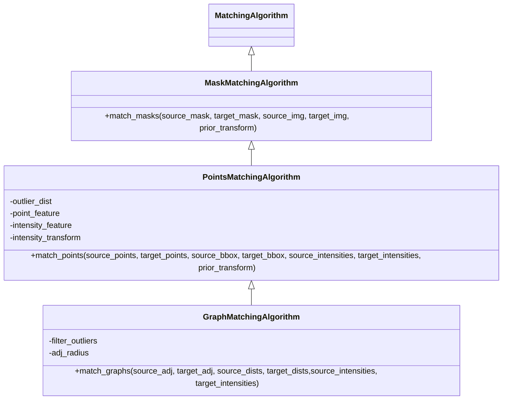

# Overview

All matching algorithms implemented in spellmatch share a common interface.

## Algorithm types

There are three main types of matching algorithms implemented in spellmatch:

- **Mask matching algorithms** take pairs of cell *masks* and, optionally, single- or
  multichannel 2D *images* matching in width and height to produce a probabilistic
  matching. The two masks (images) are expected to approximately align (co-register) in
  physical space; their physical alignment can be specified using a projective
  *transform*.

- **Points matching algorithms** take pairs of *points* (i.e., sets of spatial cell 
  coordinates) and, optionally, corresponding single-cell *intensities* to produce a
  probabilistic matching. The two sets of points are expected to approximately align
  (co-register) in physical space; their physical alignment can be specified using a
  projective *transform*. *Bounding boxes* may be specified to exclude non-overlapping
  spatial regions from the matching process.

- **Graph matching algorithms** take pairs of *spatial cell graphs* (i.e., adjacency
  matrices) to produce a probabilistic matching. Optionally, these cell graphs can be
  *attributed*: single-cell *intensities* can be specified as node features, and spatial
  cell-cell *distances* can be specified as edge features. In general, graph matching
  algorithms do not consider spatial alignment *per se*, however, when used in points
  matching mode (see below), they may take spatial alignment into consideration.

## Algorithm polymorphism

By constructing (attributed) graphs from sets of spatial cell coordinates and,
optionally, corresponding single-cell intensities, every graph matching algorithm may be
used in a points matching setting (*points matching mode*). Similarly, by extracting
spatial cell coordinates and, optionally, corresponding single-cell intensities from
pairs of masks (images), every points matching algorithm may be used in a mask matching
setting (*mask matching mode*).

This hierarchy is also reflected in the following class diagram, where children inherit
all functionality from their parents:

## Iterative algorithms

In addition, *iterative* variants of the points matching and graph matching algorithms
exist:

- `IterativePointsMatchingAlgorithm`
- `IterativeGraphMatchingAlgorithm`

As their name suggests, these algorithms iteratively refine a spatial transform by
matching cells, adding a geometric constraint (cf. image co-registration) to the
matching problem. Note that not every points matching/graph matching algorithm may be
used in an iterative setting, as support for matching priors is required to this end.
Please refer to [(Ravindra et al., 2019)](https://arxiv.org/abs/1908.03201) for further
conceptual information.
