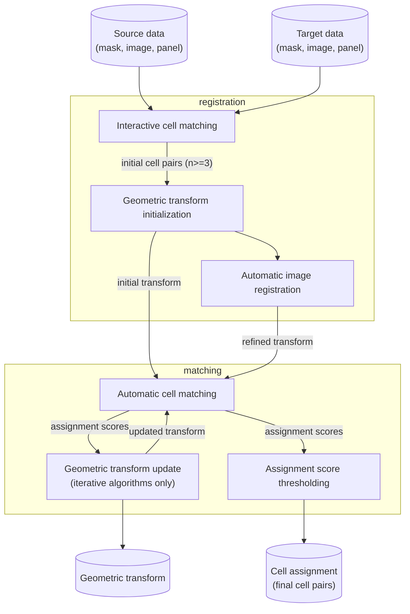

# Introduction

<!-- TODO docs -->

## Workflow

The following flowchart illustrates the *spellmatch* workflow. Blue rectangles indicate
*steps*, yellow boxes represent *modules*. Cylinders indicate input and output data of
the workflow.

## Input data

Spellmatch requires pairs of source data and target data, where source/target data
consist of:

- 2D cell masks (TIFF files of any data type)
- 2D single- or multichannel images (TIFF files of any data type, optional)
- For multi-channel images: panel with channel information (CSV files, in channel order)  
  Column headers: `name` (channel name, unique), `keep` (`0` or `1`, optional)

Images and corresponding masks have to match in size. For multi-channel images, the
number of rows in the panel (exluding column headers) has to match the number of image
channels. Images and masks are matched by filename (alphabetical order).

Source and target data are matched by filename (alphabetical order). Source and target
images/masks do not have to have the same size, scale (pixel size), or number of
channels. Source panel and target panel can share channels, but do not have to.

## Tasks

For convenience, multiple steps are combined into *tasks*. For each task, *spellmatch*
provides a dedicated *command*. The individual tasks and commands are described on the
following pages.

1. [Mask alignment](mask_alignment.md)
    - Interactive cell matching
    - Geometric transform initialization
2. [Image registration](image_registration.md) (optional)
    - Automatic image registration
3. [Spatial cell matching](spatial_cell_matching.md)
    - Automatic cell matching
    - Geometric transform update
4. [Cell assignment](cell_assignment.md)
    - Assignment score thresholding
