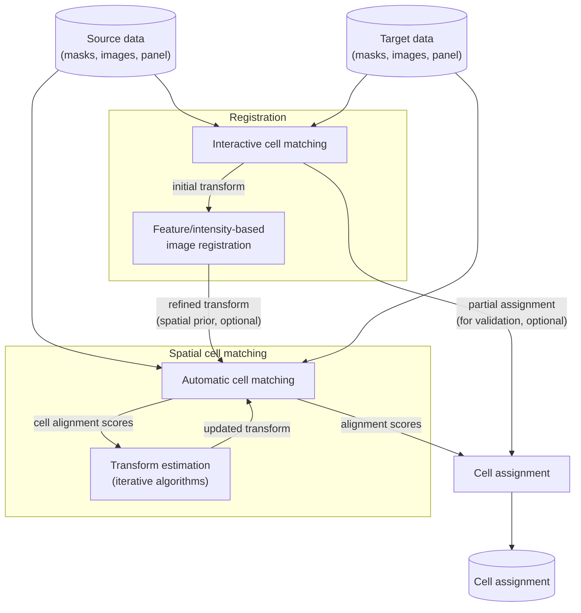

# Introduction

In this chapter, the usage of spellmatch is introduced by example. The dataset being
showcased can be found [in the spellmatch repository](
https://github.com/BodenmillerGroup/spellmatch/tree/main/data/datasets/kuett_catena_2022
) (subset of Kuett & Catena et al, 2021).

## Workflow

The following flowchart illustrates the spellmatch workflow. Blue rectangles indicate
*steps*, yellow boxes represent *modules*. Cylinders indicate input and output data of
the workflow.

## Usage

Spellmatch can be used from the command-line (terminal in Linux/MacOS, console in
Windows):

    ❯ spellmatch --help
    Usage: spellmatch [OPTIONS] COMMAND [ARGS]...

    Options:
      --version  Show the version and exit.
      --help     Show this message and exit.

    Commands:
      ...
    ...

Most spellmatch commands support a `-v` option for enabling more verbose output. In
addition, many spellmatch commands support a `--show` option for visualizing the current
operation. At any point, use the `--help` option to display additional information about
a specific command.

All spellmatch commands can operate on individual file pairs as well as on entire
directories.

## Input

Spellmatch requires pairs of source data and target data, where source/target data
consist of:

- Cell masks (TIFF files of any data type)
- Single- or multichannel images (TIFF files of any data type, optional)
- For multichannel images: panel with channel information (CSV files, in channel order)  
  Column headers: `name` (channel name, unique), `keep` (`0` or `1`, optional)

Images and corresponding cell masks have to match in size. For multichannel images, the
number of rows in the panel (exluding column headers) has to match the number of image
channels. Images and cell masks are matched by filename (alphabetical order).

Source and target data are matched by filename (alphabetical order). Source and target
images/cell masks do not have to have the same size, scale (pixel size), or number of
channels. Source panel and target panel can share channels, but do not have to.

## Tasks

For convenience, multiple steps are combined into *tasks*. For each task, spellmatch
provides a dedicated *command*. The individual tasks and commands are described on the
following pages.

1. [Image registration](registration.md)
    - Interactive cell matching
    - Feature-based image registration
    - Intensity-based image registration
2. [Spatial cell matching](matching.md)
3. [Cell assignment](assignment.md)

## Output

Spellmatch produces the following output data:

- Projective transformations (3x3 numpy array, stored as numpy `.npy` files)  
  *Note: geometric transforms are computed from centered masks/images*
- Cell alignment scores (xarray DataArray, stored as netCDF `.nc` files)  
  Shape: source labels x target labels, data type: floating point
- Cell assignments (CSV files holding cell label pairs)  
  Column headers: `Source` (source cell label), `Target` (target cell label)

By default, all files are named `{source}_to_{target}.{suffix}`, where `{source}`
is the source image/cell mask name and `{target}` is the target image/cell mask name.